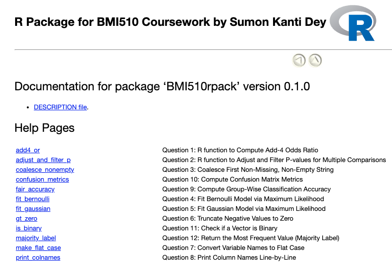
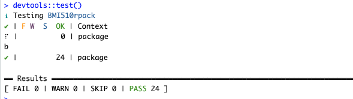

# 📦 BMI510rpack

**BMI510rpack** is an R package created by Sumon Kanti Dey for the BMI510 course at Emory University. It includes a collection of utility functions for statistical modeling, performance evaluation, and data cleaning — with clear documentation and examples.


## 📌Functions Provided:
```
1. add4_or(), 2. adjust_and_filter_p(), 3. coalesce_nonempty(), 4. fit_bernoulli(), 5. fit_gaussian(),
6. gt_zero(), 7. make_flat_case(), 8. print_colnames(), 9. fair_accuracy(), 10. confusion_metrics()
11. is_binary(), 12. majority_label()
```


## ⚙️ Working on the Package

## Step-by-step instructions
1. Clone the repository
```
git clone https://github.com/SumonKantiDey/BMI510rpack
cd BMI510rpack
```
2. Open R or RStudio, then run: 
```
library(devtools)
library(roxygen2)

# Generate documentation
document()

# Install the package locally
install()

# Run documentation/help and full checks
help(package = "BMI510rpack")
devtools::document()
devtools::install()
devtools::check()
```

3.  Make sure Rtools is installed if you're on Windows for check() to run properly.
4. Run all unit tests: Finding all test files in the tests/testthat/ directory
```
devtools::test()
```



5. If you make changes, commit them and push back to GitHub:
```
git status
git add .
git commit -m "Added function XYZ"
git push
```